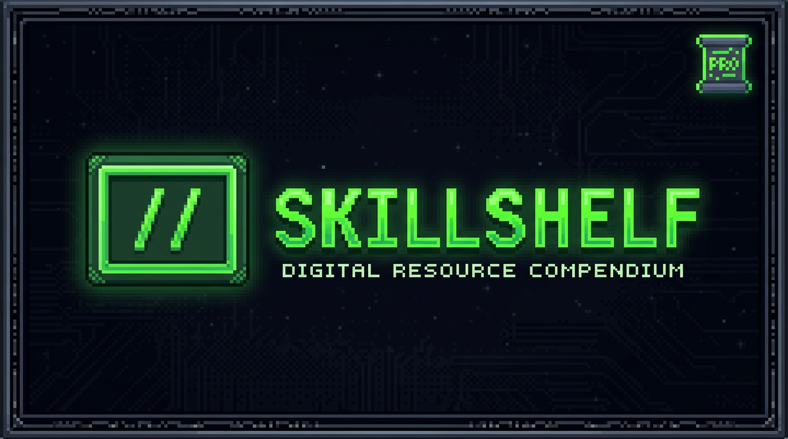

<div align="center">



### **// Free Design Skill Library**

**Stop shipping ugly.** Get SKILL.md files that turn your AI-generated code into premium, pixel-perfect UI.

[Live Demo](#) · [Report Bug](https://github.com/Samyk000/skillshelf/issues) · [Request Feature](https://github.com/Samyk000/skillshelf/issues)

---


</div>

---

## // The Problem

You spend hours prompting your AI for a decent UI. You type *"make it look premium"*. It gives you a gradient. You say *"minimal and clean"*. It removes all the padding. You ask for *"modern design"*. It adds a carousel from 2012.

**The result?** A generic, soulless interface that screams "I was generated in 30 seconds."

Your AI is smart. But it doesn't understand design. It doesn't know what makes a button feel intentional, what spacing creates hierarchy, or why certain typography choices make a page feel premium.

---

## // The Solution

**Skillshelf fixes this.**

Each skill is a `SKILL.md` file — a design instruction set that teaches your AI assistant exactly how to build beautiful, consistent UI. Drop it into your project, and watch your AI go from "basic mess" to "pixel-perfect."

### What You Get

```
01 CURATED DESIGNS        Hand-crafted design systems, not random AI guesses
02 LIVE PREVIEWS          See exactly what you're getting before you use it
03 ONE-CLICK COPY         Paste directly into your project — no friction
04 INSTANT DOWNLOAD       Save .md files for Cursor, Claude, ChatGPT, v0
05 MULTIPLE STYLES        From brutalist to minimal, pick what fits your vibe
06 ALWAYS FREE            No paywalls, no subscriptions, just good design
```

---

## // Why It Works

Your AI doesn't need to *understand* design. It just needs the right instructions.

A `SKILL.md` file contains:

- **Design tokens** — exact colors, spacing, typography values
- **Component patterns** — how to structure buttons, cards, layouts
- **Interaction rules** — hover states, transitions, responsive behavior
- **Visual hierarchy** — what to emphasize, what to downplay

Instead of fighting with prompts for hours, you copy one file. Your AI reads it. It builds exactly what you want.

**10 seconds vs 10 hours.** That's the difference.

---

## // Design Styles

| Style | Vibe |
|-------|------|
| `Paper` | Clean, paper-inspired minimal — for when less is more |
| `Minimal SaaS` | Simple, elegant landing pages — conversion-focused |
| `Editorial` | Magazine-style layouts — content that commands attention |
| `Soft Dashboard` | Gentle, approachable UIs — data that feels friendly |
| `Brutalist` | Bold, raw, unapologetic — for brands that don't blend in |
| `Enterprise` | Professional interfaces — serious software, seriously designed |
| `Premium Dark` | Luxurious dark themes — for when black isn't dark enough |
| `Bento Product` | Grid-based layouts — organized chaos, beautifully contained |
| `Docs-Focused` | Documentation-first — because good docs deserve good design |
| `Pricing Pages` | Conversion-optimized — turn visitors into customers |

---

## // How To Use

### Step 1: Browse

Visit the [library](https://skillshelf.dev/skills) and find a design style that matches your project.

### Step 2: Preview

Click any skill to see a live preview. Check the colors, spacing, typography — make sure it fits your vision.

### Step 3: Copy or Download

Click **"COPY SKILL"** to grab the `SKILL.md` content, or **"DOWNLOAD .MD"** to save it locally.

### Step 4: Paste Into Your Project

**Cursor:** Add the content to your `.cursorrules` file or project instructions.

**Claude:** Paste it at the start of your conversation as system context.

**ChatGPT:** Use it as a custom instruction or paste it in your prompt.

**v0:** Include it in your prompt for instant design consistency.

### Step 5: Watch The Magic

Your AI now understands design. It builds components that actually look good. No more generic gradients. No more soulless interfaces.

---

## // Tech Stack

| Layer | Technology |
|-------|------------|
| **Framework** | Next.js 16.2.1 (App Router) |
| **Language** | TypeScript 5 |
| **Styling** | Tailwind CSS 4 |
| **Components** | shadcn/ui |
| **Database** | Supabase (PostgreSQL) |
| **Auth** | Supabase Auth |
| **Markdown** | react-markdown + Shiki |
| **Fonts** | Space Grotesk + JetBrains Mono |

---

## // Getting Started

### Prerequisites

- Node.js 18+
- A [Supabase](https://supabase.com) account

### Installation

```bash
# Clone the repository
git clone https://github.com/Samyk000/skillshelf.git
cd skillshelf

# Install dependencies
npm install

# Set up environment variables
cp .env.example .env.local

# Start development server
npm run dev
```

Open [http://localhost:3000](http://localhost:3000) in your browser.

### Environment Variables

```env
NEXT_PUBLIC_SUPABASE_URL=your_supabase_project_url
NEXT_PUBLIC_SUPABASE_ANON_KEY=your_supabase_anon_key
```

---

## // Scripts

```bash
npm run dev      # Start development server
npm run build    # Build for production
npm run start    # Start production server
npm run lint     # Run ESLint
```

---

## // Contributing

Contributions are welcome. Please follow these steps:

1. Fork the repository
2. Create a feature branch (`git checkout -b feature/amazing-feature`)
3. Commit your changes (`git commit -m 'Add amazing feature'`)
4. Push to the branch (`git push origin feature/amazing-feature`)
5. Open a Pull Request

---

## // License

This project is licensed under the MIT License — see the [LICENSE](LICENSE) file for details.

---

<div align="center">

**Built with `//` care**

*Because your AI deserves better design instructions.*

</div>
